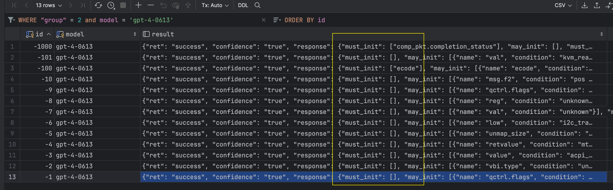

## Description

This repo contains all the code and test cases for the LLift project

For verification, we provide a docker image to run the program with several cases
(a super set of Table 4 in the paper)


## Quick Start

0. `set OPENAI_API_KEY` in the `docker-compose` file with your own key.

1. `docker-compose build app` to build image
2. `docker-compose up -d`  start the containers
3. `docker exec -it llift_ae_container /bin/bash` to go to the container "app"
4. `cd /app/app` to go to the project directory
5. `/bin/bash run_min_expr.sh` to run the program


## Expected result

The program will run for a while (30min), and then put back all the results to the database

connect to the database with the following configuration:

```
"host": "127.0.0.1",
"database": "ubidb1",
"user": "ubiuser1",
"password": "ubitect",
"port": 5433
```
(the port is weird, but it is the port we use in the `docker-compose` file)

And in the table "sampling_res", you can find the result.

The expected result should be:



> focusing on the "must_init", it should be either empty or "something" (i.e., a varaible)

> **Note**: the result may be slightly different due to the randomness of GPT-4


## Run single case

use `python run.py --id <n> --group <m>` to run a single case, where `n` is the case number and `m` is the group number. The group number has the following rule:

> - 20: TP cases of UBITect, use for test (bug-50)
> -  3: selective cases for comparison (Cmp-40)
> - 11: random-1000
> - 2: a small subset of "20", for quick test

For Cmp-40. The id from -412 to -400 are 13 real bugs, and -626 to -600 are 27 false positives from UBITect.